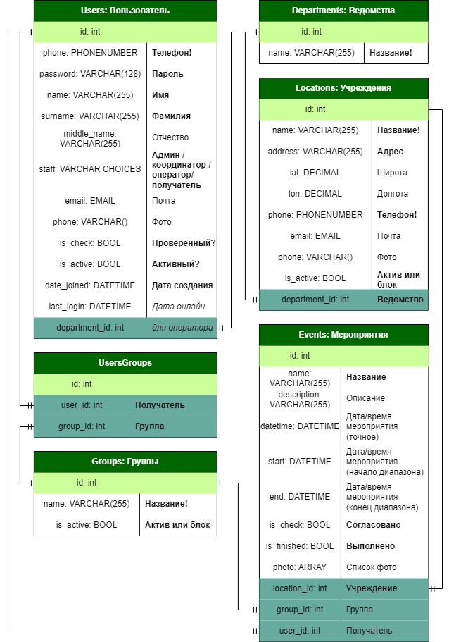

# ЕИС "Комплексная реабилитация инвалидов"

---

## Архитектура и структура базы данных:
- Реализация с использованием СУБД PostgreSQL 15

### Сущности:

**Users**
- Уникальные поля: username, phone
- Обязательные поля: username, password, name, surname, staff, phone, is_check, is_active, date_joined
  - Если staff = CO (Координатор) + email
  - Если staff = OP (Оператор) + email, department_id

**Groups**
- Уникальные поля: name
- Обязательные поля: name, is_active

**UserGroups**
- Обязательные поля: user_id, group_id
  - у user_id обязательно staff = RE

**Departments**
- Уникальные поля: name
- Обязательные поля: name

**Locations**
- Уникальные поля: name, phone
- Обязательные поля: name, address, phone, is_active, department_id

**Events**
- Обязательные поля: name, (datetime | start | end), is_check, is_finished, location_id, (group_id | user_id)
    - у user_id обязательно staff = RE
---
## Жизненный цикл пользователей, бизнес-логика:

**1. Администратор**
- Добавление администратора
- Создание ведомств
- Самостоятельное добавление пользователей (при необходимости)
- Оповещения о регистрации координаторов и операторов по email и в ЛК администратора
- Валидация координаторов и операторов (is_check=True)
- Повторная активация пользователей при необходимости (is_active=True)
- Любые манипуляции с БД при необходимости

**2. Оператор**
- Регистрация профиля (is_check=False)
- Ожидание проверки валидации администратором (is_check=True)
- После валидации:
  - Создание учреждений собственного ведомства (оператор обязательно относиться к определенному ведомству, которое указывает при регистрации)
  - Оповещения о проверке валидации координатором получателей (is_check=True) по email и в ЛК оператора
  - Контроль выполнения cобытий получателями (is_finished=True)
  - Просмотр активных и валидных получателей в активных группах (is_active=True)
  - Просмотр информации о всех учреждениях, кроме неактивных учреждений других ведомств и просмотр ведомств
  - Создание/редактирование/удаление(is_active=False) учреждений собственного ведомства
  - Просмотр всех событий, создание/редактирование кроме поля is_check/удаление событий с учреждениями собственного ведомства
  - Просмотр информации об активных и валидных координаторах (is_check=True, is_active=True)
  - Просмотр информации об активных и валидных операторах (is_check=True, is_active=True)
  - Просмотр информации об активных и валидных получателях (is_check=True, is_active=True)
  - Просмотр/редактирование кроме полей staff, is_active и is_check/удаление(is_active=False) собственного профиля
  

**3. Координатор**
- Регистрация профиля (is_check=False)
- Ожидание проверки валидации администратором (is_check=True)
- После валидации:
  - Оповещения о регистрации получателей (is_check=False) по email и в ЛК координатора
  - Валидация получателей (is_check=True)
  - Повторная активация получателей при необходимости (is_active=True)
  - Оповещения о создании оператором событий для получателей (is_check=True) по email и в ЛК координатора
  - Отмена валидации событий при необходимости (is_check=False)
  - Создание/просмотр/редактирование кроме поля is_active/удаление(is_active=False) групп получателей
  - Просмотр/добавление/удаление получателей в активных группах (is_active=True)
  - Просмотр информации об активных учреждениях (is_active=True) и ведомствах
  - Просмотр всех событий
  - Просмотр информации об активных и валидных координаторах (is_check=True, is_active=True)
  - Просмотр информации об активных и валидных операторах (is_check=True, is_active=True)
  - Просмотр информации о всех получателях
  - Просмотр/редактирование кроме полей staff, is_active и is_check/удаление(is_active=False) собственного профиля

**4. Получатель**
- Регистрация профиля (is_check=False)
- Ожидание проверки валидации координатором (is_check=True)
- После валидации:
  - Просмотр информации об активных учреждениях (is_active=True) и ведомствах
  - Просмотр информации об активных и валидных координаторах (is_check=True, is_active=True)
  - Оповещения о добавлении событий в маршрут получателя (is_check=True) по email (если есть) и в ЛК координатора
  - Просмотр только собственных валидных событий (is_check=True)
  - Просмотр маршрута реабилитации (событий)
  - Просмотр/редактирование кроме полей staff, is_active и is_check/удаление(is_active=False) собственного профиля

---
## Backend
- Реализация проекта на фреймворке Django 4.2.3
- Интерпретатор python 3.11
- Все зависимости в файле *minproj/requirements.txt*
- Переменные среды в файле *minproj/.env*
### Микросервисная архитектура:
- minproj - конфигурационный модуль, объединяющий микросервисы
- Minapp - моделирование БД, сущность Users, UsersGroups
- Coordinators - регистрация Users (staff="CO")
- Operators - регистрация Users (staff="OP")
- Recipients - регистрация Users (staff="RE")
- Groups - сущность Groups, UsersGroups
- Departments - сущность Departments
- Locations - сущность Locations
- Events - сущность Events
---
## Маршруты и права доступа
- Openapi: 3.0.2
- /swagger-ui/
### /auth/signin/
- POST: Вход в систему (все пользователи) 
---
### /coordinators/signup/ 
- POST: Регистрация Координатора (User.staff = "CO") (все пользователи) 

### /recipients/signup/ 
- POST: Регистрация Получателя (User.staff = "RE") (все пользователи) 

### /operators/signup/ 
- POST: Регистрация Оператора (User.staff = "OP") (все пользователи) 
---
### /whoami/
- GET: Получение информации пользователя по токену (активные пользователи (is_active=True))
---
### /users/
- GET: Получение списка пользователей 
  - Администратор - все пользователи 
  - Координаторы (валидные и активные) - активные и валидные координаторы и операторы, все получатели
  - Операторы (валидные и активные) - активные и валидные координаторы, операторы и получатели
  - Получатели (валидные и активные) - активные и валидные координаторы
- POST: Создание пользователя
  - Администратор - создание любого пользователя

### /users/coordinators/
- GET: Получение списка координаторов 
  - Администратор - все координаторы 
  - Координаторы, операторы, получатели (валидные и активные) - активные и валидные координаторы

### /users/operators/
- GET: Получение списка операторов 
  - Администратор - все операторы 
  - Координаторы и операторы (валидные и активные) - активные и валидные операторы

### /users/recipients/
- GET: Получение списка получателей 
  - Администратор - все получатели 
  - Координаторы (валидные и активные) - все получатели
  - Операторы (валидные и активные) - активные и валидные получатели

### /users/{id}/
- GET: Получение профиля пользователя 
  - Администратор - любой пользователь 
  - Координаторы (валидные и активные) - активный и валидный координатор или оператор, любой получатель
  - Операторы (валидные и активные) - активный и валидный координатор или оператор, или получатель
  - Получатели (валидные и активные) - активный и валидный координатор, собственный профиль
- PATCH: Редактирование профиля пользователя 
  - Администратор - любой пользователь 
  - Координаторы (валидные и активные) - редактирование собственного профиля, кроме staff, is_active и is_check (только администраторы), редактирование полей is_check и is_active любого получателя
  - Операторы (валидные и активные) - редактирование собственного профиля, кроме staff, is_active и is_check (только администраторы)
  - Получатели (валидные и активные) - редактирование собственного профиля, кроме staff и is_active (только администраторы) и is_check (только администраторы и координаторы)
- DELETE: Удаление профиля пользователя 
  - Администратор - удаление любого пользователя из БД 
  - Остальные валидные и активные пользователи - удаление собственного доступа к сервису (is_active=False)

### /users/{id}/groups/
- GET: Получение списка групп получателя 
  - Администратор - все группы получателя 
  - Координаторы (валидные и активные) - все активные группы получателя
  - Операторы (валидные и активные) - все активные группы активного и валидного получателя
- POST: Добавление получателя в группу
  - Администратор - добавление любого получателя в любую группу 
  - Координаторы (валидные и активные) - добавление любого получателя в активную группу
- DELETE: Удаление получателя из группы 
  - Администратор - удаление любого получателя из любой группы 
  - Координаторы (валидные и активные) - удаление любого получателя из активной группы

### /users/{id}/events/
- GET: Получение списка событий получателя 
  - Администратор - все события получателя 
  - Координаторы (валидные и активные) - все события получателя 
  - Операторы (валидные и активные) - все события получателя 
  - Получатели (валидные и активные) - только собственные валидные (is_check=True) события
---
### /groups/
- GET: Получение списка групп 
  - Администратор - все группы 
  - Координаторы (валидные и активные) - активные группы
  - Операторы (валидные и активные) - активные группы
- POST: Создание группы
  - Администратор
  - Координаторы (валидные и активные)

### /groups/{id}/
- GET: Получение группы 
  - Администратор - любая группа 
  - Координаторы (валидные и активные) - активная группа
  - Операторы (валидные и активные) - активная группа
- PATCH: Редактирование группы
  - Администратор 
  - Координаторы (валидные и активные)
- DELETE: Удаление группы 
  - Администратор - удаление группы из БД 
  - Координаторы (валидные и активные) - делают группу неактивной (is_active=False)

### /groups/{id}/users/
- GET: Получение списка получателей в группе 
  - Администратор - все получатели в группе 
  - Координаторы (валидные и активные) - все получатели в активной группе
  - Операторы (валидные и активные) - все активные и валидные получатели в активной группе
- POST: Добавление получателя в группу
  - Администратор - добавление любого получателя в любую группу 
  - Координаторы (валидные и активные) - добавление любого получателя в активную группу
- DELETE: Удаление получателя из группы 
  - Администратор - удаление любого получателя из любой группы 
  - Координаторы (валидные и активные) - удаление любого получателя из активной группы
---
### /departments/
- GET: Получение списка ведомств 
  - Администратор
  - Валидные и активные пользователи
- POST: Создание ведомства
  - Администратор

### /departments/{id}/
- GET: Получение ведомства 
  - Администратор
  - Валидные и активные пользователи
- PATCH: Редактирование ведомства 
  - Администратор
- DELETE: Удаление ведомства 
  - Администратор

### /departments/{id}/locations/
- GET: Получение списка учреждений ведомства 
  - Администратор - все учреждения ведомства
  - Координаторы (валидные и активные) - активные учреждения ведомства 
  - Операторы (валидные и активные) - все учреждения ведомства (если оператор связан с ведомством) или активные учреждения ведомства (если оператор не связан с ведомством) 
  - Получатели (валидные и активные) - активные учреждения ведомства
---
### /locations/
- GET: Получение списка учреждений 
  - Администратор - все учреждения
  - Операторы (валидные и активные) - все учреждения, кроме неактивных учреждений других ведомств (с которыми оператор не связан) 
  - Координаторы (валидные и активные) - активные учреждения
  - Получатели (валидные и активные) - активные учреждения
- POST: Создание учреждения
  - Администратор - создание любого учреждения
  - Операторы (валидные и активные) - создание учреждения собственного ведомства

### /locations/{id}/
- GET: Получение учреждения 
  - Администратор - любое учреждение
  - Операторы (валидные и активные) - любое учреждение, кроме неактивных учреждений других ведомств (с которыми оператор не связан)
  - Координаторы (валидные и активные) - активное учреждение
  - Получатели (валидные и активные) - активное учреждение
- PATCH: Редактирование учреждения 
  - Администратор - редактирование любого учреждения
  - Операторы (валидные и активные) - редактирование учреждения собственного ведомства, кроме поля department_id (только администратор)
- DELETE: Удаление учреждения 
  - Администратор - удаление любого учреждения из БД 
  - Операторы (валидные и активные) - делают учреждение собственного ведомства неактивным (is_active=False)
---
### /events/
- GET: Получение списка событий 
  - Администратор - все события
  - Операторы (валидные и активные) - все события 
  - Координаторы (валидные и активные) - все события
  - Получатели (валидные и активные) - свои валидные (is_check=True) события
- POST: Создание события
  - Администратор - создание любого события
  - Операторы (валидные и активные) - создание события с учреждением собственного ведомства

### /events/{id}/
- GET: Получение события 
  - Администратор - любое событие
  - Операторы (валидные и активные) - любое событие
  - Координаторы (валидные и активные) - любое событие
  - Получатели (валидные и активные) - свое валидное (is_check=True) событие
- PATCH: Редактирование события 
  - Администратор - редактирование любого события
  - Операторы (валидные и активные) - редактирование события с учреждением собственного ведомства, кроме поля is_check
  - Координаторы (валидные и активные) - изменение поля is_check любого события
- DELETE: Удаление события 
  - Администратор - удаление любого события из БД 
  - Операторы (валидные и активные) - удаление события с учреждением собственного ведомства
---